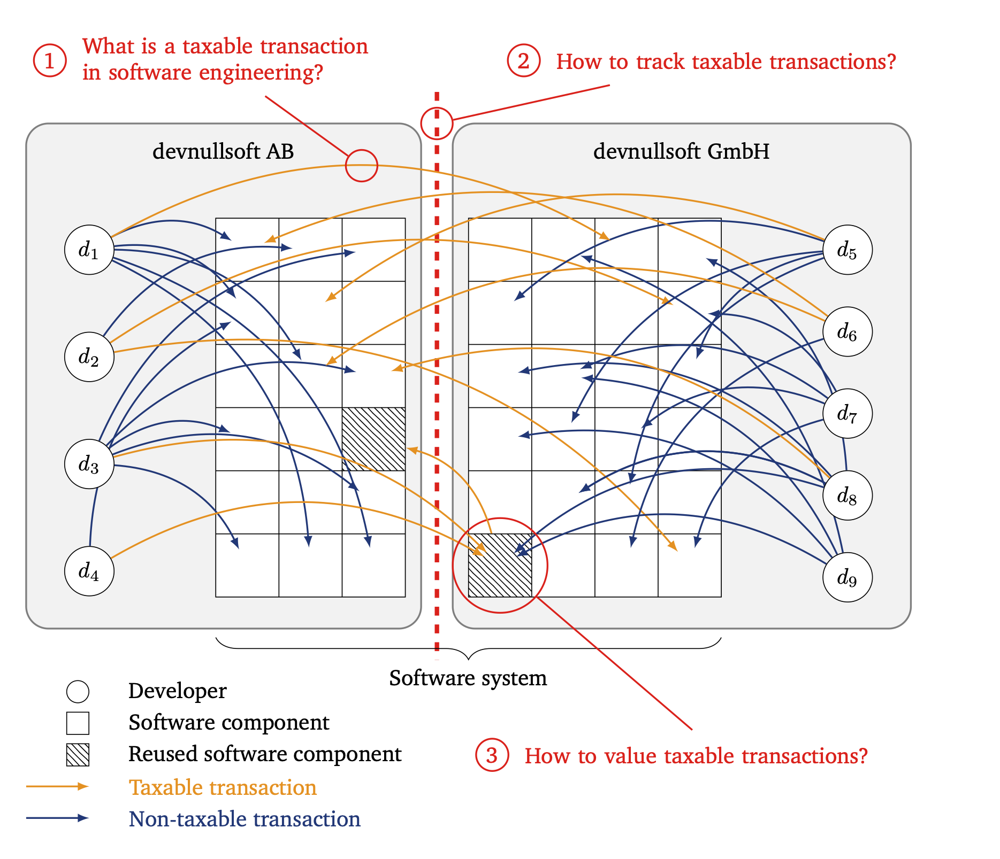

Modern software systems are often too large, too complex, and evolving too fast for single developers to oversee. Therefore, software engineering has become highly collaborative. Often, engineers and their teams collaborate across borders, especially in multinational companies with subsidiaries spread around the globe. Such collaboration has an often overlooked legal implication: the profits from those cross-border collaborations become taxable.

In this second blog post in our series on tax compliance in software engineering, we will discuss the unique and fundamental challenges of taxing collaborative software engineering. In our the last article of our series we will illustrate the industrial significance of cross-border collaboration in an industrial case, namely code review.

From [the last blog post](), we understood that companies must pay a transfer price for goods, intangibles, or services transferred in a multinational enterprise to comply with the international standards on taxation. So, what are transfer prices for collaborative software engineering that comply with this Arm's Length Principle? Determining a market price for intangibles is inherently difficult and is reflected in a broad price range. Collaborative software engineering, however, scales the problem of a transfer-price determination to a new level of complexity because the reality of modern software engineering is significantly more complex than our introductory example above may suggest. Since transfer price regulations apply to a much broader definition of intangibles compared to accounting standards, the latter can not be used as a reliable measure of value for transfer pricing purposes.

There are three main high-level challenges for transfer pricing in collaborative software engineering within multinational enterprises. The figure below illustrates the complexity in modern collaborative software engineering at *devnullsoft Group* (the fictitious multinational company from introduced in [the previous post of this series]()) and where those three challenges apply.

## Challenge 1: What is a taxable transaction in software engineering?

The trouble for transfer pricing in software engineering begins with a fundamental question: What is actually a taxable transaction in the context of collaborative software engineering? It is not immediately clear what types or characteristics classify a taxable exchange of intangibles or services across the boundaries of a country in the context of software engineering.

Among other potentially relevant types of taxable intangibles, such as *goodwill* or *group synergies*, this blog post focusses on two types of intangibles that are highly relevant for software engineering: *know-how* and *licenses*.

The OECD Transfer Pricing Guidelines define *know-how* as the "proprietary information or knowledge that assist[s] or improve[s] a commercial activity, but that [is] not registered for protection in the manner of a patent or trademar". The commercial activity includes the manufacturing, marketing, research and development of and for a software system.

Does the OECD definition imply that all types of information exchanged during collaborative software engineering are know-how? On the one hand, yes, since all information is proprietary and, to some extent, contributes to the software being developed or its engineering processes. But on the other hand, how do we know which information assists or improves the commercial activity, meaning the engineering of the software system, over time? For example, a quick and dirty bug fix without sufficient documentation or testing may improve the software system in the present but makes changes more costly or even impossible in the future.

The second type of intangibles highly relevant to transfer pricing in software engineering if transferred across borders is *licenses*. Although maybe not even explicit, the company-internal use and reuse of components is an instance of licensing. Complex software systems are not monolithic blocks of code but consist of components that are developed, shared, and reused by separate teams. However, we lack a common understanding of software components and reuse in software engineering for taxation. Not every component is directly used for or in a software-intensive product, but maybe adds value to the product. For example, a well-engineered CI/CD pipeline accelerates the development cycles and brings new features or bug fixes faster to the customers. Furthermore, it is also not always clear who owns, contributes to, or uses a component within a company, and the roles may even change over time. In contrast to open source, the reuse is often implicit, lacking a company-wide license agreement that clarifies the responsibility and accountability between component owners and users. Even worse, we do not even know if our definition and understanding of code ownership suffices the definition of ownership in a taxation context.

Additionally, we see an interplay between those two types of intangibles, know-how and licensing, since they may be two sides of the same collaboration. For example, when code contributions from a component user support instances of reuse.


**Insight:** Identifying the taxable transactions requires either a holistic perspective of software engineering or at least suitable, practical, and accurate proxies. Compliant software engineering needs a common understanding and a taxonomy of taxable transactions specific to software engineering.


## Challenge 2: How to track cross-border transactions in software engineering?

Also, the practical tracking of taxable know-how and licensing (and potentially other types of intangibles) is a challenge on its own.

Tracking know-how is an inherently difficult task. Since the teams collaborating are no longer colocated, numerous tools enable an exchange of know-how in software engineering. Those tools are suitable as rich data sources to different extents: While domain-specific tools like issue trackers or collaborative software development platforms like GitHub or Gitlab often track the exchanges very thoroughly, other communication and collaboration tools do not: Online meetings, for example, can facilitate an exchange of taxable intangibles, but this exchange is not tracked by any tool. But even if there is a rich data basis available, leveraging those data sources is problematic for following reasons:

1. Establishing location: It can be difficult to establish the location of collaborators or capture when a location of a collaborator has changed, because organizations often preserve only the latest version of the organizational structures.
2. Privacy: Analyzing the complete communication of developers may be perceived as a measure of surveillance, which raises ethical and legal concerns related to privacy.

In contrast to the potentially rich sources for tracing taxable transactions from collaboration tools used in software engineering, tracking company-internal reuse often lacks a solid data basis. Although companies often track the reuse of external open-source components for open-source license compliance purposes, those tools are rarely used or suitable for tracking company-internal reuse. Also, only reuse that crosses borders is taxable; information that is often not available or stored over time, although component ownership is not static and may be subject to change.


**Insight:** Data for tracking taxable transactions may be incomplete, faulty with respect to location, or restricted. There is no dedicated tool support yet for the practical transfer price determination.


## Challenge 3: How to value taxable transactions in software engineering?

While it is inherently difficult to tax intangibles in general, things are even more complicated in software engineering. Potentially taxable intangibles cover a large range of granularity: They may be as large as a microservice providing user authentication which itself is used by microservices of other teams (see intangible *licenses*) or as small as a code change, code review, or bug report (see intangible *know-how*). Although the code change or feedback in a code review is small—maybe even only one line of code, like in the case of the *Heartbleed* security bug in the OpenSSL cryptography library from 2014—the potential impact on the software system can be tremendous or even fatal. A software change or a code review delivers value through impact, not size.

The same applies to licensing. The number of use relations of a software component or its size (however defined) does not reflect the value provided to the software-intensive product. While the software component for user authentication may be important for operating the software-intensive product and, therefore, has a large amount of depedent software components, it is not differentiating and may even be considered a commodity.

This means we cannot simply use purely quantitative measurements for transfer pricing. However, the sheer mass of small, fine-grained transactions of all types makes a human qualitative case-by-case evaluation impossible.


**Insight:** A purely quantitative valuing can hardly reflect the value of transactions; however, a purely qualitative assessment does not scale with the magnitude of cross-border transactions in modern software development. Transfer pricing requires a tool-supported processes that assists tax and software engineering experts.


## Is the problem an actual problem?

In our next blog post, we will look into the preveleance of taxable cross-border collaboration and find out if the problem of taxation is an acutal challenge.


This series is based on our research article *[Taxing Collaborative Software Engineering](https://doi.ieeecomputersociety.org/10.1109/MS.2023.3346646)* published as open-access at IEEE Software.

