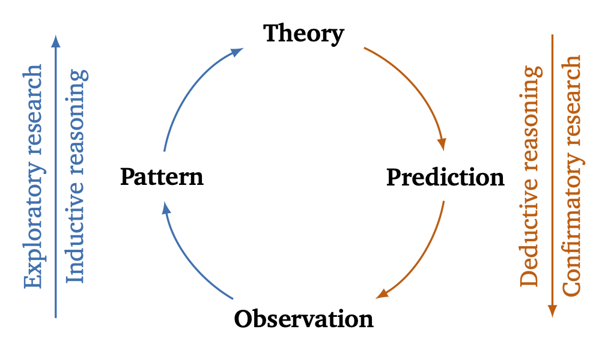

> In many ways, the authors kind of created something without input from the stakeholders, and the stakeholders told them what mattered, which is not represented.  It feels unfortunately backwards as a result.<br>
> — <cite>Reviewer 1 from a prestigous software engineering journal</cite>

In this blog post, I explain (not only to reviewer 1 from a prestigious software engineering journal 🙄) the differences and, more importantly, the interplay between exploratory research and confirmatory research.

Let's start with graphical approach to the (pragmatic) empirical research cycle involving both exploratory (theory-generating) and confirmatory (theory-testing) research.



## Two Sides of the Same Coin

Exploratory research begins with specific observations, distills patterns in those observations, and derives theories from the observed patterns using inductive reasoning. The nature of exploratory research enables to analyze chosen cases and their contexts in great detail, but also leads to limited generalizability as they are drawn from those specific cases (especially when there is little relation to existing evidence that would allow for generalization by analogy). As such, it remains susceptible to researcher bias due to the absence of an already existing theory.

Confirmatory research, in turn, begins with a theory, makes predictions (often in the form of hypotheses), and evaluates whether those predictions hold true or not in empirical observations. To build a robust body of knowledge, we obviously need both exploratory and confirmatory research following complementary research methods (and qualitative and  data) to minimize bias and maximize the validity and reliability of our theories efficiently.

## Backwards and Forwards

We clearly see that reviewer 1 from the quote above was expecting an exploratory study, while we designed a confirmatory one. The choice of research method in our study could have given him a hint: How would you conduct an experiment with hypotheses (*predictions*) without an initial theory? The fact that we could not confirm our theory is not a valid reason for rejection.

## TikZ Code

In case the text or the figure above is helpful for your paper or your rejoinder, feel free to use the text and the TikZ graphic:

```
\documentclass[border=2mm]{standalone}
\usepackage{charter}
\usepackage{tikz}
\usepackage{xcolor}
\definecolor{blue}{RGB}{0, 114, 178}
\definecolor{red}{RGB}{213, 94, 0}

\begin{document}
\begin{tikzpicture} 
\foreach \a/\t in {90/Theory, 0/Prediction, -90/Observation, -180/Pattern}{
    \node (\t) at (\a:2cm) {\textbf{\t}};
}

\draw[-latex, thick, red] (90-25:2cm) arc (90-25:0+10:2cm);
\draw[-latex, thick, red] (0-10:2cm) arc (0-10:-90+30:2cm);
\draw[-latex, thick, blue] (-90-30:2cm) arc (-90-30:-180+10:2cm);
\draw[-latex, thick, blue] (-180-10:2cm) arc (-180-10:-270+25:2cm);

\draw[latex-, thick, blue] (-3.5,2) -- (-3.5,-2) node[blue, midway, anchor=north, rotate=90] {Inductive reasoning} node[blue, midway, anchor=south, rotate=90] {Exploratory research}; 
\draw[-latex, thick, red] (3.5,2) -- (3.5,-2) node[red, midway, anchor=south, rotate=90] {Deductive reasoning} node[red, midway, anchor=north, rotate=90] {Confirmatory research}; 
\end{tikzpicture}
\end{document}
```