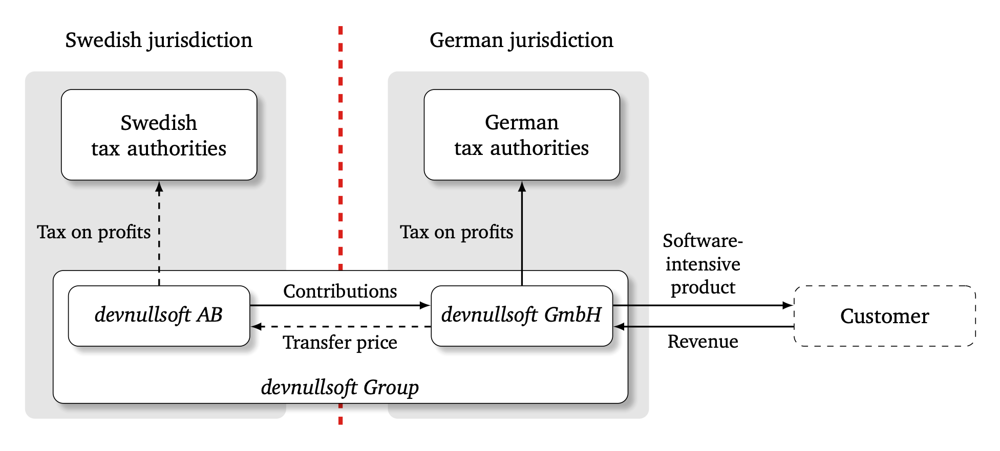

> He’s spending a year dead for tax reasons. 
> — <cite>Douglas Adams, The Hitchhiker’s Guide to the Galaxy</cite>

Modern software systems are often too large, too complex, and evolving too fast for single developers to oversee. Therefore, software engineering has become highly collaborative. Often, engineers and their teams collaborate across borders, especially in multinational companies with subsidiaries spread around the globe. Such collaboration has an often overlooked legal implication: the profits from those cross-border collaborations become taxable.

In this first blog post in our series on tax compliance in software engineering, we start with a gentle introduction to international standards in multinational taxation and its basic Arm's Length Principle from a software engineering perspective. And no worries, no prior knowledge or background is needed. In the following blog posts of this series, we will then discuss the unique challenges of taxing collaborative software engineering and we will illustrate the industrial significance of cross-border collaboration using code review in an industrial case.

## A Simplified Example

Let's start with a fictitious multinational enterprise called *devnullsoft Group* that develops and sells a software-intensive product. *devnullsoft Group* has two legal entities: *devnullsoft GmbH* in Germany and its subsidiary *devnullsoft AB* in Sweden. The German development team employed by *devnullsoft GmbH* develops the software jointly with their Swedish colleagues employed by the Swedish *devnullsoft AB*. The German *devnullsoft GmbH* sells the resulting product to customers.

## The Underlying Problem

Without any further consideration, solely the German *devnullsoft GmbH* generates profits, which are then fully taxed in Germany according to German law. The Swedish tax authorities are left out in the cold because *devnullsoft AB* has no share of the profit that could be taxed in Sweden, although *devnullsoft AB* contributed significantly to the product through code contributions, code reviews, bug reports, tests, architectural decisions, or other contributions that made the success of the software possible.

## The Arm's Length Principle

To avoid this scenario and to provide a common ground for international taxation, reducing uncertainty for multinational enterprises, and preventing tax avoidance through profit shifting, nearly all countries in the world agreed on and implemented the so-called Arm's Length Principle as defined in the [OECD Transfer Pricing Guidelines for Multinational Enterprises and Tax Administrations](https://www.oecd.org/tax/transfer-pricing/oecd-transfer-pricing-guidelines-for-multinational-enterprises-and-tax-administrations-20769717.htm). The Arm's Length Principle is the guiding principle and the de-facto standard for the taxation of multinational enterprises. It requires associated enterprises to operate as if they were not associated to another and, from a taxation perspective, are regular participants in the market. This principle ensures that transfer prices between associated companies of multinational enterprises are established on a market value basis and not misused for profit shifts from high to low tax regions.

To comply with the Arm's Length Principle, *devnullsoft GmbH* in Germany and *devnullsoft AB* in Sweden must operate from a taxation perspective as if they were not associated. Since a regular participant in the market would not provide code contributions, code reviews, tests, or architectural designs free or other contributions of charge to a closed-source software project, *devnullsoft GmbH* in Germany needs to pay for the received contributions, the so-called **transfer price**.

## Transfer Prices

Transfer prices are the prices at which an enterprise transfers physical goods and intangibles or provides services to associated enterprises. Since software is intangible itself, the transfer of intangibles like source code, code reviews, bug reports, etc., is our focal point. This transfer price guarantees that *devnullsoft AB* gets its share of the profit, which then can be taxed by the Swedish tax authorities.

In the schematic overview above, we summarize the mechanics of our fictitious company of transfer pricing between the two associated software companies from our example. Although *devnullsoft AB* contributed significantly to the software-intensive product, without a transfer price, *devnullsoft AB* has no share of profits; all profits are fully taxable in Germany only. However, if *devnullsoft GmbH* in Germany pays a transfer price reflecting the value for the services and intangible properties received from its Swedish associated enterprise, *devnullsoft AB* realizes profits, which then are taxable in Sweden. The Arm's Length Principle is upheld.

## The Dark Side

The *devnullsoft Group* does not artificially shift profits to a tax haven. Yet, one can easily imagine that neglecting to charge arm's length prices can be intentionally misused for profit-shifting. Therefore, the OECD guidelines permit tax authorities like the Swedish tax authority to adjust the transfer price where the prices charged are outside an arm's length range. Such an adjustment will carry interest and might be coupled with penalties. In the wake of the OECD's [Base Erosion and Profit Shifting (BEPS) Project](https://www.oecd.org/tax/beps/), the regulatory framework has become considerably stricter at an international and national level. As a result, tax authorities can demand more comprehensive information to detect misalignments and enforce tax adjustments. From the companies' perspective, its software development may be (intentionally or unintentionally) non-compliant and face the risk of being legally prosecuted.

## The Challenges

Now that we understand the underlying mechanics of tax compliance and the transfer price at *arm's length* as its guiding principle, read the [next blog post in this series](), where we discuss the tax compliance challenges specific to software engineering.


This series is based on our research article _[Taxing Collaborative Software Engineering](https://doi.ieeecomputersociety.org/10.1109/MS.2023.3346646)_ published as open-access at IEEE Software.

